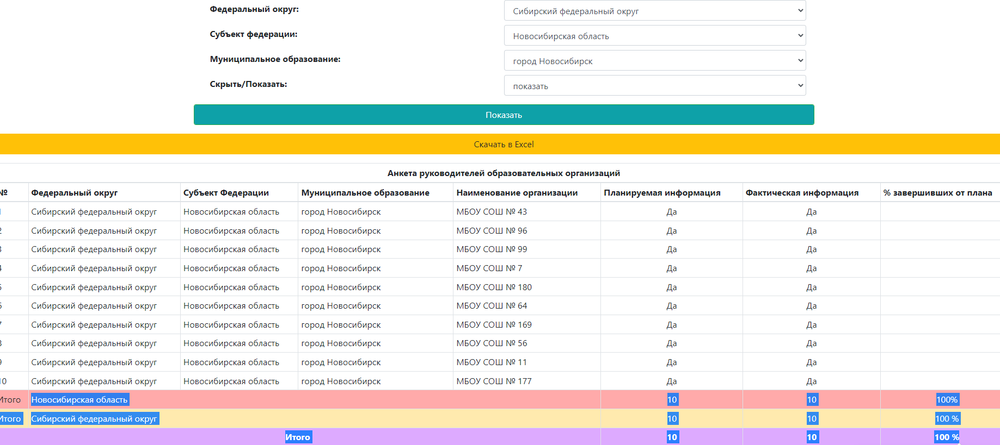
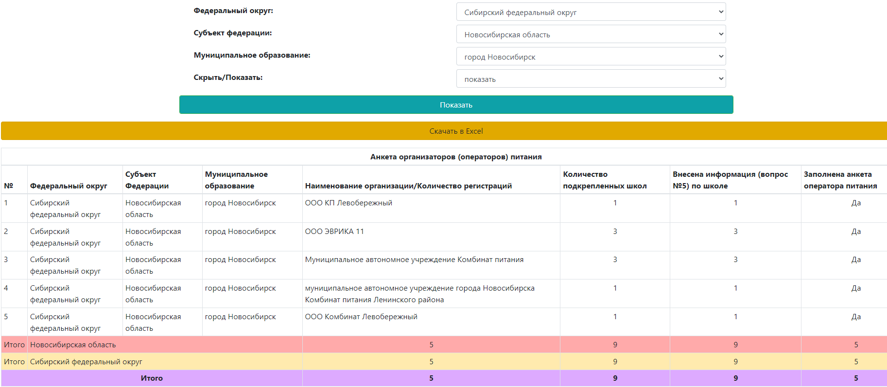
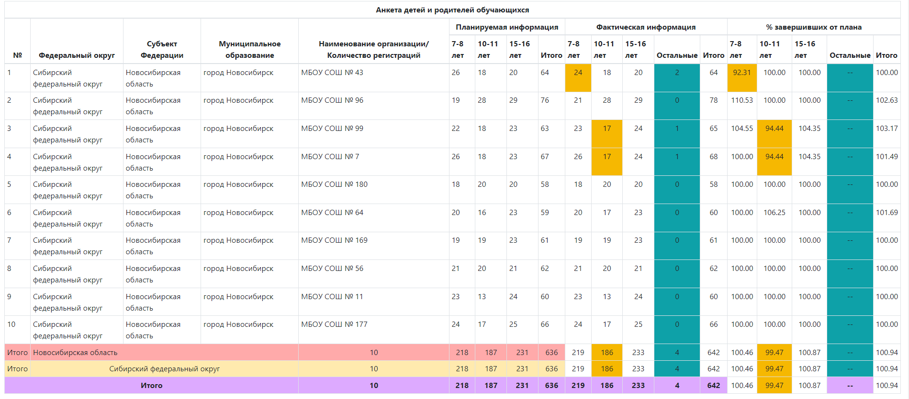
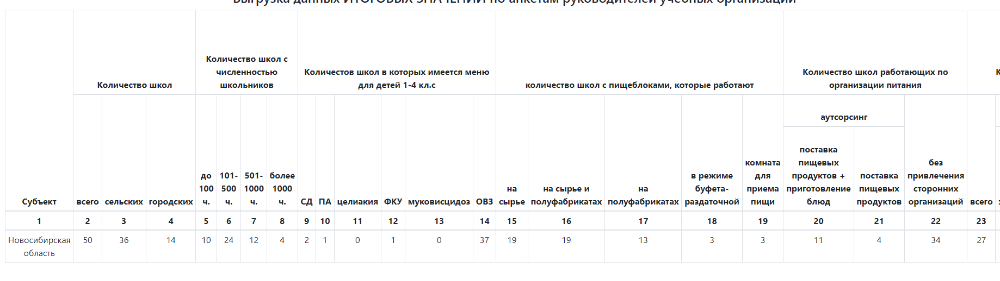
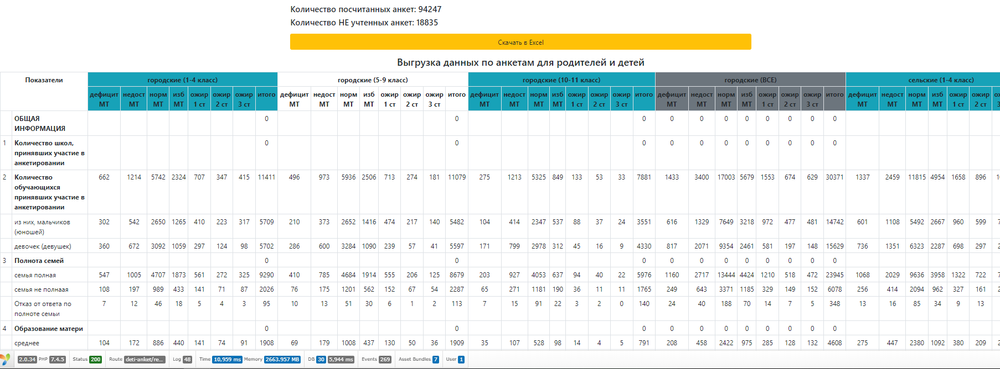
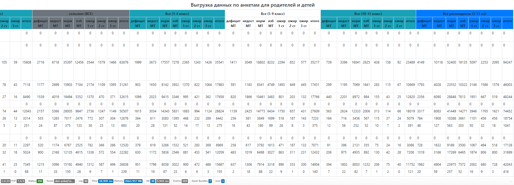
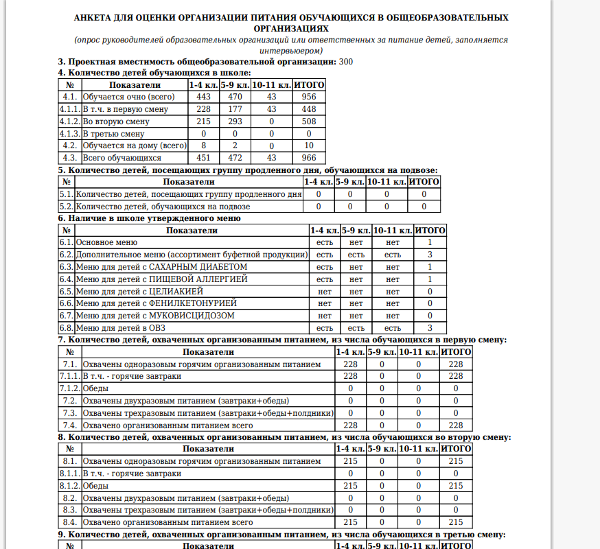
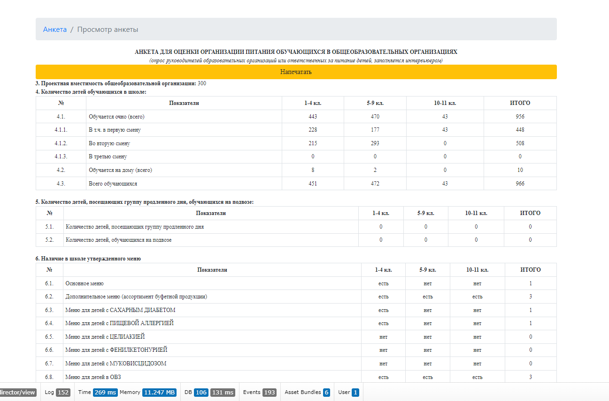
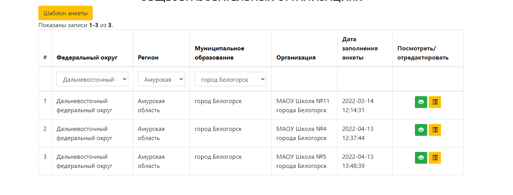
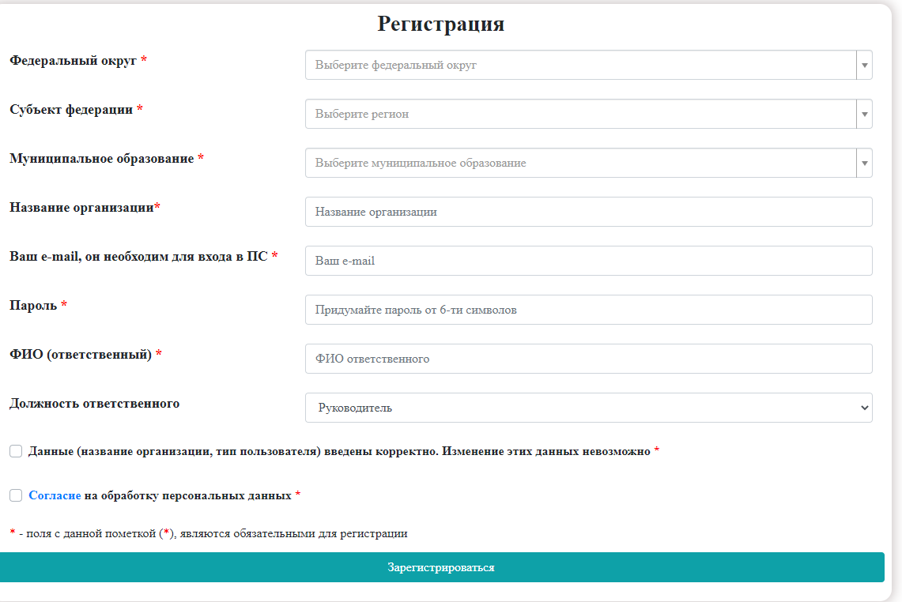

### В данном примере реализованно:
1. [Главная страница](#Вид-проекта)
2. [Отчеты](#Отчеты)
3. [Дополнительно](#Скрины)

### Вид проекта:
>__Главная страница:__
>
____
[:arrow_up:В данном примере реализованно](#В-данном-примере-реализованно)
___
### Отчеты:
>__Отчет 1 ([пример кода](https://github.com/VladJutnik/collecting-information/blob/master/backend/controllers/UsersController.php) метод - actionReportAnket1()):__
>
>__Отчет 2 ([пример кода](https://github.com/VladJutnik/collecting-information/blob/master/backend/controllers/UsersController.php) метод - actionReportAnket2()):__
>
>__Отчет 3 ([пример кода](https://github.com/VladJutnik/collecting-information/blob/master/backend/controllers/UsersController.php) метод - actionReportAnket3()):__
>
>__Отчет 4 ([пример кода](https://github.com/VladJutnik/collecting-information/blob/master/backend/controllers/DirectorController.php) метод - actionReportListItog()):__
>
>__Отчет 5 ([пример кода](https://github.com/VladJutnik/collecting-information/blob/master/backend/controllers/DetiAnketController.php) метод - actionReportAdminMatrix()):__
>
>
____
[:arrow_up:В данном примере реализованно](#В-данном-примере-реализованно)
___
## Скрины
>__Пример печати ([пример кода](https://github.com/VladJutnik/collecting-information/blob/master/backend/controllers/FoodController.php) метод - actionPrintAnketPattern()):__
>
>__Просмотр - печать, view для просмотра и для печати из одной views ([пример кода](https://github.com/VladJutnik/collecting-information/blob/master/backend/views/food/create.php)):__
>
>__Search model, любая модель с подписью Search:__
>
>__Регистрация:__
>
____
[:arrow_up:В данном примере реализованно](#В-данном-примере-реализованно)
___